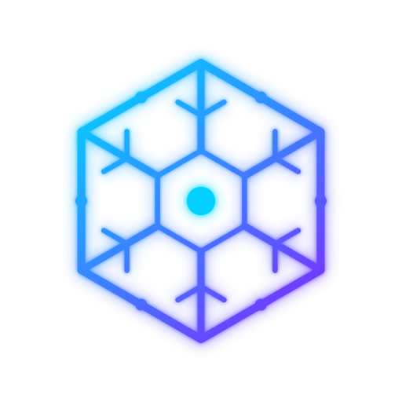

<p align="center">
  
</p>

# Cryo

The Alienware command center Dell never shipped for Linux. A root daemon +
QML GUI + CLI built on the mainline **alienware-wmi** kernel driver — no
`acpi_call`, no out-of-tree modules — that does things stock AWCC (and the
Windows original) don't:

- **Custom fan curves** — temp→boost curves per fan group with hysteresis,
  driven through the kernel's `custom` platform profile.
- **Thermal Guard** — an emergency failsafe in *any* profile: trip
  temperatures force 100% fans, hold, then restore your previous state.
- **Game detection** — sustained dGPU load (NVML) flips the machine into
  G-Mode automatically, and restores your previous profile when you quit.
- **Auto profiles** — battery → quiet, AC → balanced, all configurable,
  fired on transitions only so manual picks stick.
- **Live telemetry** — CPU/GPU temps, fan RPM, dGPU load, sparkline
  history, in-window and in the tray tooltip.
- **AlienFX lighting** — 4-zone keyboard effects (protocol ported from
  AWCC), including a `quantum` cyan↔violet preset, restored on boot.

Developed on an **Alienware m18 R2** (Pop!_OS); designed for the wider
alienware-wmi ecosystem — the daemon probes what your machine supports at
startup (profiles, G-Mode, fan boost, lighting, turbo control, NVML) and
every client renders only what exists. See
[docs/COMPATIBILITY.md](docs/COMPATIBILITY.md) for the feature matrix and
the tested-models table — reports welcome, working or not:

```sh
cryoctl doctor   # hardware/driver report, made for pasting into an issue
```

## Architecture

```
┌──────────────┐   unix socket (JSON lines)   ┌─────────────────────┐
│ cryo-gui     │◄────────────────────────────►│ cryod (root,        │
│ (QML + tray) │      /run/cryo.sock          │  systemd service)   │
└──────────────┘                              │  · platform profile │
┌──────────────┐                              │  · hwmon fan boost  │
│ cryoctl (CLI)│◄────────────────────────────►│  · NVML game sense  │
└──────────────┘                              │  · AlienFX ELC USB  │
                                              └─────────────────────┘
```

Everything thermal goes through sysfs (`alienware-wmi` kernel driver):
the per-handler node under `/sys/class/platform-profile/` and the
`alienware_wmi` hwmon (`fan*_boost`, `fan*_input`, `temp*_input`).
Lighting talks to the AW-ELC USB controller (`187c:0550/0551`) directly.

Profile names are translated per machine from what the kernel advertises.
On G-Mode-capable models:

| Cryo/AWCC name | kernel platform_profile |
| -------------- | ----------------------- |
| performance    | balanced-performance    |
| gmode          | performance             |
| custom         | custom (manual fans)    |

On models without G-Mode, kernel `performance` *is* AWCC Performance and
Cryo labels it accordingly.

## Install

```sh
git clone https://github.com/I4cTime/cryo.git && cd cryo
sudo packaging/install.sh   # venv sync + /etc/cryo + systemd unit + icons + .desktop
```

Requires: the `alienware-wmi` kernel driver (mainline), Python 3.12+, `uv`,
and — for game detection — the NVIDIA proprietary driver.

## Use

```sh
cryoctl status | watch
cryoctl profile gmode / cryoctl gmode
cryoctl boost cpu 60
cryoctl light quantum / cryoctl light static 00D1FF
cryoctl doctor
cryo-gui
```

Config lives at `/etc/cryo/config.json` (deep-merged over defaults in
`cryo/daemon/config.py`) — fan curve points, guard thresholds, auto-rule
targets, game detection thresholds, socket group.

## Notes

- Lighting protocol ported from tr1xem/AWCC (GPL-3.0); this repo is
  GPL-3.0-or-later accordingly.
- Game detection needs the NVIDIA driver's NVML (present with the
  proprietary driver). Without it, Cryo degrades to manual + AC/battery
  rules only.
- Fan boost is not implemented by every model's firmware; when the
  startup probe finds it missing, curves and the Thermal Guard disable
  themselves visibly rather than failing silently.
